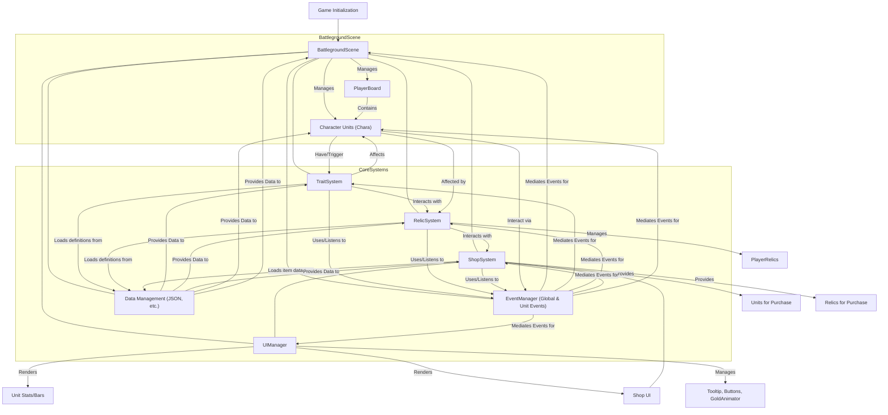

relics were removed (focusing on unit balance for now)

## Assets credits

https://opengameart.org/content/rpg-sound-pack gold_coin ui_toggle
(metal-small1) swing

https://opengameart.org/content/punches-hits-swords-and-squishes sword1,2,3

https://www.kenney.nl/assets/interface-sounds button_click.ogg error.ogg

https://opengameart.org/content/cure-magic oga-cure-magic1.wav

https://opengameart.org/content/punch-slap-n-kick punch1.ogg

https://opengameart.org/content/54-casino-sound-effects-cards-dice-chips
chip-lay-3.ogg

https://opengameart.org/content/weapon-slash-effect sword-slash.png

https://pixabay.com/sound-effects/shining-anime-sound-effect-240582/
shining-anime-sound-effect-240582

https://www.zapsplat.com/music/anime-noisy-laser-blip/
zapsplat_cartoon_anime_laser_blip_noisy_92477
