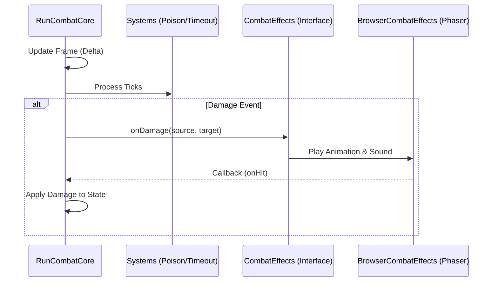
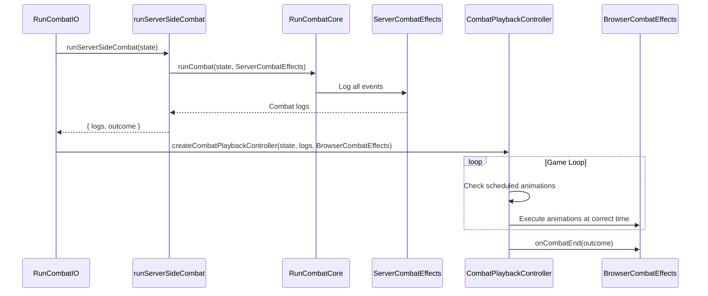

# Combat Client-Server Architecture

This document describes the architectural separation between the core combat logic (Server/Shared) and the visual presentation (Client). This design allows the game to run efficient, verifiable combat simulations in a headless server environment while maintaining a rich visual experience in the browser.

## Overview

The combat system is designed around a strict Separation of Concerns:
1.  **Core Logic**: Handles rules, damage, stats, and outcomes. Pure TypeScript, no Phaser dependencies.
2.  **Interface Layer**: Defines how the Core interacts with the outside world (visuals, sounds, logs).
3.  **Implementation**: Platform-specific handlers (Phaser for Client, Mock/Log for Server).
4.  **Playback System**: Decouples combat simulation from animation timing, allowing server-side computation with client-side playback.

## Architecture Components

### 1. Core Logic (`RunCombatCore.ts`)

- **Location**: `phaser/src/Scenes/Battleground/RunCombatCore.ts`
- **Responsibility**: Manages the game loop, processes cooldowns, applies effects (damage/heal), and determines win/loss conditions.
- **Dependencies**: Imports *only* data models (`State`, `Unit`, `Force`) and pure logic systems (`TimeoutDamageSystem`, `PoisonDamageSystem`). **No Phaser imports allowed.**

The `runCombat` function is the entry point:
```typescript
export const runCombat = (state: State, effects: CombatEffects): CombatRunner
```

### 2. The Interface (`CombatEffects`)

- **Location**: `phaser/src/Scenes/Battleground/CombatEnvironment.ts`
- **Responsibility**: Defines the contract for all side-effects. The Core Logic calls these methods to "announce" what happened, without knowing *how* it is presented.

Key methods include:
- `onDamage(sourceId, targetId, onHit)`
- `onUnitPop(unitId)`
- `updateLifeDisplay(force, life, ...)`

```typescript
export type CombatEffects = {
    onDamage: (sourceId: string, targetId: string, onHit: () => void) => void;
    // ...
};
```

### 3. Implementations

#### Client-Side (`BrowserCombatEffects.ts`)
- **Location**: `phaser/src/Scenes/Battleground/BrowserCombatEffects.ts`
- **Context**: Runs in the browser (Electron/Web).
- **Behavior**: Implements `CombatEffects` using Phaser 3. Triggers animations, particles, camera shakes, and sound effects.

#### Server-Side (`ServerCombatEffects.ts`)
- **Location**: `phaser/src/Scenes/Battleground/ServerCombatEffects.ts`
- **Context**: Runs in Node.js or browser for simulation.
- **Behavior**: Implements `CombatEffects` using loggers. Records all combat events with frame numbers and durations for playback.

### 4. Playback System (`CombatPlaybackController.ts`)

- **Location**: `phaser/src/Scenes/Battleground/CombatPlaybackController.ts`
- **Responsibility**: Schedules and executes animations based on pre-computed combat logs from server-side simulation.
- **Key Features**:
  - Accepts combat logs with frame numbers and durations
  - Implements `CombatRunner` interface for compatibility
  - Schedules animations in chronological order
  - Executes visual effects at appropriate times

## Data Flow

### Traditional Flow (Deprecated)


### Current Playback Flow


## Usage

### Running Locally (Client)
The game initializes combat using the playback system in `RunCombatIO.ts`:

```typescript
export const runCombatIO = (): CombatRunner => {
    const state = getState();
    
    // Run server-side simulation to get logs
    const combatResult = runServerSideCombat(state);
    
    // Create playback controller with logs
    const effects = createBrowserCombatEffects();
    const playbackController = createCombatPlaybackController(
        state, 
        combatResult.logs, 
        effects
    );
    
    return playbackController;
};
```

### Running on Server
The server can run combat simulation directly:

```typescript
import { runServerSideCombat } from './serverCombatDemo';

const result = runServerSideCombat(gameState);
console.log('Combat outcome:', result.outcome);
console.log('Combat logs:', result.logs);
```

## Benefits

1. **Deterministic**: Combat results are computed server-side, ensuring consistency
2. **Verifiable**: Server can validate combat outcomes independently
3. **Replayable**: Combat logs can be saved and replayed later
4. **Network-Ready**: Easy to move simulation to actual server for multiplayer
5. **Performance**: Combat calculation doesn't block rendering
