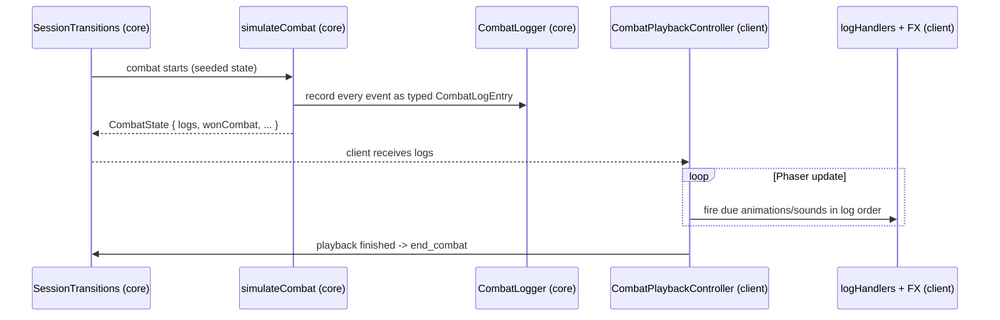

# Combat Architecture

Combat is fully simulated inside the pure `core/` package and then played
back visually by the client. Simulation and presentation never mix.

## Components

### Simulation (`core/`)

- `core/src/Combat/CombatRunner.ts` — the frame-by-frame combat loop:
  cooldowns, effect dispatch through the TriggerSystem, status systems
  (poison, regen, timeout), win/loss detection.
- `core/src/Combat/CombatSimulation.ts` — `simulateCombat()` runs a combat
  to completion and returns the resulting `CombatState` (including the logs
  and `wonCombat`). Deterministic for a given seed.
- `core/src/Combat/CombatLogger.ts` — the typed `CombatLogEntry` union
  (damage, heal, shield, poison, regen, haste, slow, charge, power changes,
  ticks, outcome, ...). Everything the client needs to render the fight.
- `core/src/session/SessionTransitions.ts` — calls `simulateCombat` when a
  session transitions into combat; the produced logs travel with the
  session/combat state back to the client.

### Playback (`phaser/src/`)

- `Screens/Battleground/Phases/Combat/CombatPlaybackController.ts` —
  `createCombatPlaybackController(...)` schedules the log entries on the
  Phaser clock and fires them in order.
- `Screens/Battleground/Phases/Combat/logHandlers/` — dispatches each log
  type to visuals (`projectileHandlers.ts`, `statusHandlers.ts`,
  `powerHandlers.ts`, `arcaneMissileHandlers.ts`, `combatStatsHandlers.ts`),
  with shared styling adapters in `logHandlers/visuals/`.
- `phaser/src/FX/` — reusable Phaser effect primitives
  (`arcaneMissileTargeted`, `fireballEffect`, `summonEffect`, ...). See
  [effect-system.md](effect-system.md).

## Data flow

## Properties

1. **Deterministic** — same seed and inputs produce the same combat and logs.
2. **Verifiable** — a server can re-run `simulateCombat` and compare outcomes
   (see [game-server.md](game-server.md)).
3. **Replayable** — logs can be stored and replayed without re-simulation.
4. **Headless** — simulation runs in Node with zero Phaser/DOM imports (see
   [purity-boundary.md](purity-boundary.md)).
