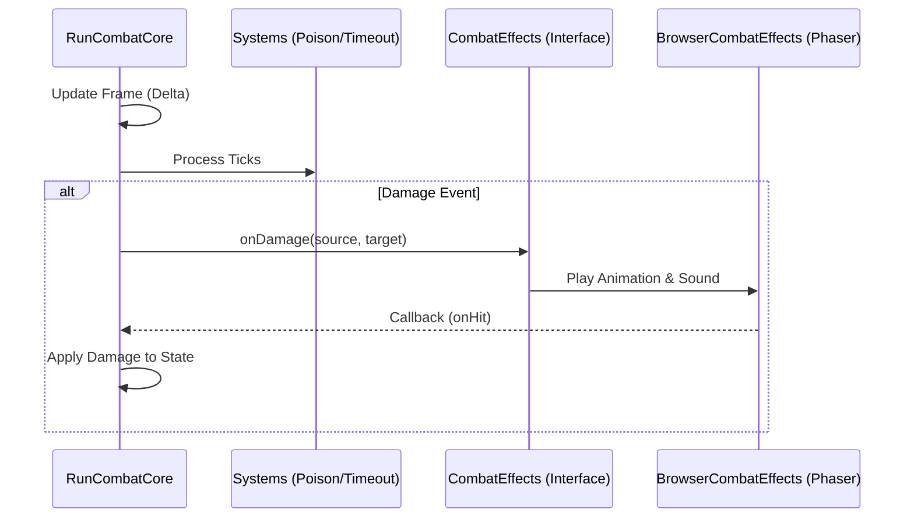

# Combat Client-Server Architecture

This document describes the architectural separation between the core combat logic (Server/Shared) and the visual presentation (Client). This design allows the game to run efficient, verifiable combat simulations in a headless server environment while maintaining a rich visual experience in the browser.

## Overview

The combat system is designed around a strict Separation of Concerns:
1.  **Core Logic**: Handles rules, damage, stats, and outcomes. Pure TypeScript, no Phaser dependencies.
2.  **Interface Layer**: Defines how the Core interacts with the outside world (visuals, sounds, logs).
3.  **Implementation**: Platform-specific handlers (Phaser for Client, Mock/Log for Server).

## Architecture Components

### 1. Core Logic (`RunCombatCore.ts`)

- **Location**: `phaser/src/Scenes/Battleground/RunCombatCore.ts`
- **Responsibility**: Manages the game loop, processes cooldowns, applies effects (damage/heal), and determines win/loss conditions.
- **Dependencies**: Imports *only* data models (`State`, `Unit`, `Force`) and pure logic systems (`TimeoutDamageSystem`, `PoisonDamageSystem`). **No Phaser imports allowed.**

The `runCombat` function is the entry point:
```typescript
export const runCombat = (state: State, effects: CombatEffects): CombatRunner
```

### 2. The Interface (`CombatEffects`)

- **Location**: `phaser/src/Scenes/Battleground/CombatEnvironment.ts`
- **Responsibility**: Defines the contract for all side-effects. The Core Logic calls these methods to "announce" what happened, without knowing *how* it is presented.

Key methods include:
- `onDamage(sourceId, targetId, onHit)`
- `onUnitPop(unitId)`
- `updateLifeDisplay(force, life, ...)`

```typescript
export type CombatEffects = {
    onDamage: (sourceId: string, targetId: string, onHit: () => void) => void;
    // ...
};
```

### 3. Implementations

#### Client-Side (`BrowserCombatEffects.ts`)
- **Location**: `phaser/src/Scenes/Battleground/BrowserCombatEffects.ts`
- **Context**: Runs in the browser (Electron/Web).
- **Behavior**: Implements `CombatEffects` using Phaser 3. Triggers animations, particles, camera shakes, and sound effects.

#### Server-Side / Headless
- **Example**: `phaser/src/Scenes/Battleground/serverCombatDemo.ts`
- **Context**: Runs in Node.js (e.g., for verification or mass simulation).
- **Behavior**: Implements `CombatEffects` using mocks or loggers. It ignores visual flair but ensures the combat simulation proceeds exactly as it would on the client.

## Data Flow



## Usage

### Running Locally (Client)
The game initializes `runCombat` with `createBrowserCombatEffects()` in `BattlegroundScene.ts`.

### Running on Server
The server initializes `runCombat` with `createServerCombatEffects()` (or similar mock), passing a `State` object. It then pumps the `updateFrame` loop manually or via a precise timer.
