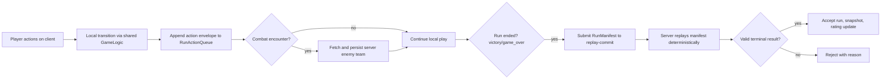

# Commit Replay in Mana Battle: Low-Power Multiplayer with Server Validation

Most multiplayer games validate every action in real time. That works, but it can be expensive: every click becomes a network round-trip, and the server must stay hot for constant per-action processing.

Mana Battle uses a different pattern for its PvE multiplayer runs: **commit replay**.

The short version:
- The player plays locally with immediate response.
- The client records a deterministic action manifest during the run.
- The server replays and validates that manifest only when the run ends.
- If the replay reaches a valid terminal state, the run is accepted.

This gives us a responsive experience on low-power devices and a backend that does much less live work.

## Why Commit Replay?

We wanted three things at once:
- Fast local gameplay, even on weaker hardware.
- Server-side trust for leaderboard/rating-impacting outcomes.
- A backend cost profile closer to "one validation per run" than "one write per click".

Commit replay satisfies all three by treating gameplay as a deterministic function of:
- initial seed
- selected core/crystal
- ordered action list
- server-anchored combat inputs

## Core Idea: Deterministic Run Manifest

During a run, the client appends actions into a `RunManifest` via `RunActionQueue`.

Each action envelope includes:
- `sequence`: strict monotonic index (1, 2, 3, ...)
- `actionId`: chosen option (encounter, shop purchase, etc.)
- `payload`: optional structured input
- `teamSnapshot`: board arrangement at decision time

Two implementation details are important:
- Board drag/move operations are not logged as unlimited `update_team` events.
- Instead, each meaningful action can carry a board snapshot, which is restored before replaying that action.

This keeps the manifest compact while still preserving deterministic board state for validation.

## Runtime Flow

### What still happens during play?

Commit replay in Mana Battle is **mostly deferred**, with one intentional online anchor:
- On `combat_encounter`, the client asks the server for the enemy team.
- The server stores that exact team for the run/combat index.
- Final replay uses those stored teams instead of re-randomizing.

That keeps combat validation fair and deterministic without requiring full server simulation on every action.

## End-of-Run Validation (`replay-commit`)

When the run reaches `victory` or `game_over`, the client submits the manifest to the `replay-commit` edge function.

The validator does the following:
- Verifies JWT and enforces `manifest.playerId == token.sub`.
- Validates manifest shape and action-count limits.
- Applies idempotency checks (`runId` + player).
- Loads server-persisted enemy teams for each combat.
- Reconstructs a fresh session from `initialSeed` + `selectedCrystalId`.
- Replays actions in strict sequence order.
- Applies each `teamSnapshot` before replaying the action.
- Produces a canonical replay snapshot from final state.
- Accepts only valid terminal runs and records the commit.

If replay fails determinism or input checks, the run is rejected with a concrete `rejectReason`.

## Why This Works on Low Processing Power

### On the player device
- Gameplay state transitions are local and immediate.
- No per-action network latency for normal decisions.
- The action log is compact and persisted, so runs can survive refresh/crash.

### On the server
- Validation cost shifts from continuous real-time processing to a single replay burst at run completion.
- Idempotency avoids duplicate heavy work.
- Enemy-team generation is lightweight and sparse (combat checkpoints only).

In practice, this means fewer live backend calls and less sustained compute pressure while preserving authoritative outcomes.

## Security and Fairness Properties

Commit replay is not "trust the client." It is "trust only what can be replayed."

The server controls and verifies:
- identity (JWT)
- run ownership
- deterministic transition execution
- canonical combat opponents
- completion state (`victory`/`game_over`)

The client controls only:
- proposed action sequence and payloads
- local UX and animation timing

If the submitted history cannot produce a valid final state under server replay, it does not count.

## Comparison with Traditional Real-Time Validation

Real-time authoritative model:
- Every action sent and validated online.
- Strong anti-cheat guarantees, but higher latency and infra cost.

Commit replay model:
- Actions played locally, then server-replayed at commit time.
- Much lower live overhead and better responsiveness.
- Strong enough guarantees for deterministic PvE progression with rating updates.

For Mana Battle's trigger-heavy autobattler loop, this is a strong fit.

## Engineering Benefits Beyond Validation

A replay-first architecture gives extra leverage:
- Reproducible bug reports from manifests.
- Deterministic regression tests for run outcomes.
- Auditable run records (`completed_run_manifests`).
- Easier balancing analysis from canonical snapshots/logs.

In other words, commit replay is not only a backend optimization; it is a tooling and quality multiplier.

## Takeaway

Mana Battle's commit replay system enables a practical middle path:
- Local, responsive gameplay suitable for low-power environments.
- Server-side vetted outcomes for multiplayer trust.
- Backend resource usage that scales closer to "one replay per run" than "one validation per click."

For deterministic game loops, this pattern is a powerful alternative to always-on real-time authority.
