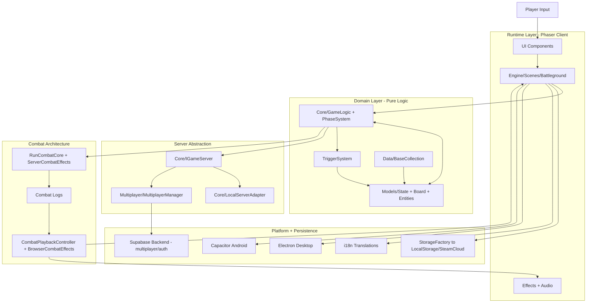

# Project Architecture

This chart describes the high-level architecture of Mana Battle and how data flows between pure game logic, Phaser runtime systems, and platform/infrastructure layers.

## Notes

- Core and Models represent replay-critical pure logic (no Phaser dependency).
- Engine/Scenes coordinates game phases and presentation.
- Combat is simulated first, then played back through logged events.
- Single-player and multiplayer both use the same game server interface (`IGameServer`).
