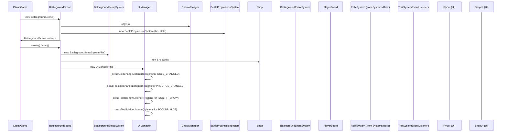
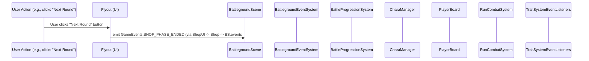

```mermaid

sequenceDiagram
    %% Title: BattlegroundScene Initialization and Shop Phase Start

    participant Client as Client/Game
    participant BS as BattlegroundScene
    participant BSetupS as BattlegroundSetupSystem
    participant UIM as UIManager
    participant CM as CharaManager
    participant BPS as BattleProgressionSystem
    participant ShopSys as Shop
    participant BES as BattlegroundEventSystem
    participant PB as PlayerBoard
    participant RelicSys as RelicSystem (from Systems/Relic)
    participant TraitSysEL as TraitSystemEventListeners
    participant Flyout as Flyout (UI)
    participant ShopUI as ShopUI (UI)

    Client->>BS: new BattlegroundScene()
    activate BS
    BS->>CM: init(this)
    BS->>BPS: new BattleProgressionSystem(this, state)
    BS->>Client: BattlegroundScene instance
    deactivate BS

    Client->>BS: create() / start()
    activate BS

    BS->>BSetupS: new BattlegroundSetupSystem(this)
    BS->>ShopSys: new Shop(this)
    BS->>UIM: new UIManager(this)
    activate UIM
    UIM->>UIM: _setupGoldChangeListener() (listens for GOLD_CHANGED)
    UIM->>UIM: _setupPrestigeChangeListener() (listens for PRESTIGE_CHANGED)
    UIM->>UIM: _setupTooltipShowListener() (listens for TOOLTIP_SHOW)
    UIM->>UIM: _setupTooltipHideListener() (listens for TOOLTIP_HIDE)
```

```mermaid
sequenceDiagram
    %% Title: Combat Phase Initiation

    participant UserAction as User Action (e.g., clicks "Next Round")
    participant Flyout as Flyout (UI)
    participant BS as BattlegroundScene
    participant BES as BattlegroundEventSystem
    participant BPS as BattleProgressionSystem
    participant CM as CharaManager
    participant PB as PlayerBoard
    participant RCS as RunCombatSystem
    participant TraitSysEL as TraitSystemEventListeners

    UserAction->>Flyout: User clicks "Next Round" button
    Flyout->>BS: emit GameEvents.SHOP_PHASE_ENDED (via ShopUI -> Shop -> BS.events

```